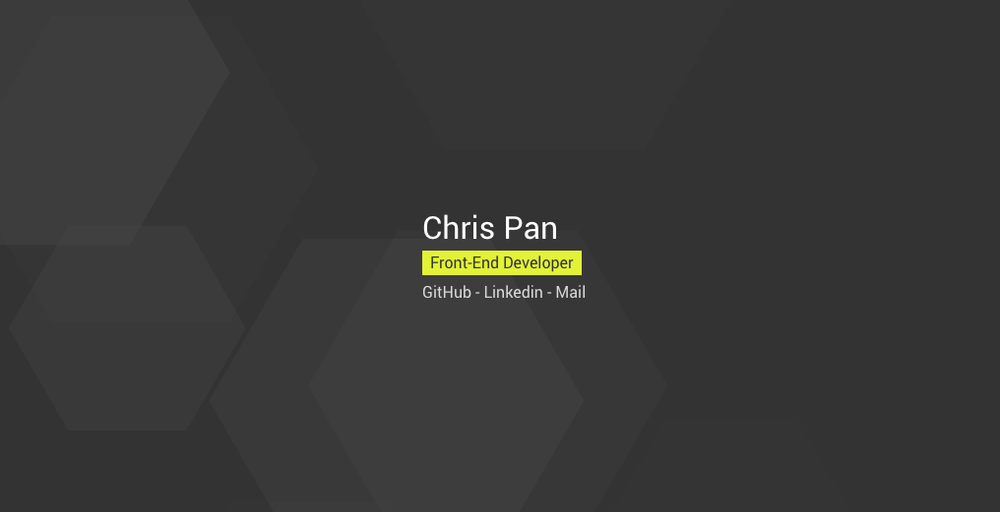

# Hexagon Dark Dimension

A responsive template for personal website / online namecard with dynamic background effects.

## Preview

[Click here](https://panteng.github.io/hexagon-dark-dimension/)

## Development

Run `gulp dev` command to start the development, Gulp will watch file changes and reflect the change immediately at `http://localhost:3000/`.

## Production

Run `gulp prod` command and you will get the minified css and js file.
